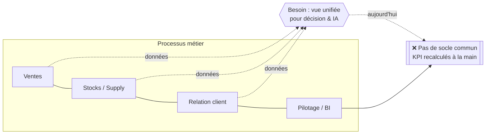
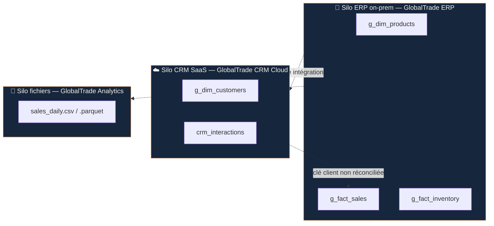

# Phase 1 — Diagnostic et choix d'architecture

**Client :** GlobalTrade Solutions (fictif) · **Mission :** cabinet de conseil
**Livrable :** synthèse diagnostic + recommandation d'architecture

---

## 1. Contexte et problématique

GlobalTrade Solutions, distributeur B2B/B2C, exploite un système d'information
**fragmenté en silos** constitué au fil des acquisitions et des choix tactiques :

- un **ERP on-premise vieillissant** (produits, stocks, ventes) ;
- un **CRM SaaS** déconnecté (clients, interactions) ;
- des **fichiers analytiques isolés** (extractions CSV/Parquet) sans gouvernance.

Cette fragmentation **bloque toute capacité analytique unifiée** et empêche la
mise en œuvre de services d'IA : il n'existe aucune vue 360 du client, les
indicateurs sont recalculés manuellement, et les données ne sont ni traçables
ni gouvernées. *« Une IA n'est intelligente qu'à la hauteur des données fiables
qu'on lui confie. »*

**Mission :** spécifier et prototyper une architecture **Lakehouse** unifiée,
capable de centraliser les données métier et d'exposer des indicateurs BI à la
demande, prête pour de futures couches d'IA agentique.

---

## 2. Cartographie du SI existant (2 niveaux)

### 2.1 Niveau fonctionnel — chaîne de valeur analytique

Au niveau fonctionnel, **quatre processus** alimentent la décision (ventes,
stocks, relation client, pilotage) mais aucun **socle de données commun** ne les
relie : la chaîne de valeur analytique est **rompue** entre la production de la
donnée et son exploitation.

### 2.2 Niveau applicatif — les 3 silos et leurs données

| Silo | Système | Hébergement | Données clés | Format | Fréquence |
|------|---------|-------------|--------------|--------|-----------|
| ERP | GlobalTrade ERP | On-premise | produits, stocks, ventes historiques | Tables SQL | Temps réel interne |
| CRM | GlobalTrade CRM Cloud | SaaS | clients, segments, interactions | API / export CSV | Asynchrone |
| Analytics | GlobalTrade Analytics | Fichiers partagés | ventes agrégées (jour/canal/pays) | CSV / Parquet | Batch manuel |

---

## 3. Constat du silotage et impacts

| Symptôme observé | Cause racine | Impact sur la valeur analytique |
|------------------|--------------|---------------------------------|
| Pas de vue 360 client | Clé client non réconciliée entre ERP et CRM | Impossible de croiser CA et segment ⇒ pas de ciblage |
| KPI incohérents selon la source | Agrégats Analytics recalculés à la main | Perte de confiance, décisions retardées |
| Données non traçables | Aucune métadonnée d'ingestion | Non-conformité RGPD (origine, rétention) |
| Latence de la donnée | Exports batch manuels asynchrones | L'information arrive trop tard pour agir |
| Qualité hétérogène | Pas de couche de nettoyage | Doublons, dates multi-formats, valeurs aberrantes |

**Conséquence stratégique :** le SI n'est **pas data-driven** et **pas prêt pour
l'IA**. Toute initiative d'IA agentique (assistant BI, prévision de la demande,
détection de churn) échouerait faute de données fiables, unifiées et gouvernées.

---

## 4. Approche data-driven proposée

Faire évoluer le SI vers une organisation **data-driven**, structurée en couches,
prête pour l'IA agentique :

1. **Unifier** les 3 silos dans un socle unique (un seul point de vérité).
2. **Gouverner** : traçabilité, qualité et conformité dès l'ingestion (medallion
   Bronze/Silver/Gold).
3. **Exposer** la donnée *as-a-service* via une API BI, consommable par les
   dashboards **et** par de futurs agents IA.
4. **Industrialiser** progressivement (urbanisation du SI : on isole l'existant
   derrière le socle plutôt que de le remplacer d'un bloc).

Cette trajectoire s'appuie sur un **data maturity model** : passer du stade
« données silotées / réactives » au stade « données gouvernées / prédictives ».

---

## 5. Analyse comparative des 3 architectures cibles

| Critère | Data Warehouse Cloud | Data Lake | **Lakehouse** |
|---------|----------------------|-----------|---------------|
| **Coût** | Élevé (stockage + compute couplés, licences) | Faible (stockage objet brut) | **Maîtrisé** (stockage objet + compute découplé) |
| **Scalabilité** | Bonne mais coûteuse | Très élevée | **Très élevée** (séparation stockage/compute) |
| **Latence requêtes** | Très bonne (optimisé SQL/BI) | Faible (pas de structure, lent) | **Bonne** (formats colonnes + indexation/tables ACID) |
| **Données supportées** | Structurées uniquement | Tout (brut, non structuré) | **Tout** (structuré + non structuré) |
| **Qualité / gouvernance** | Forte (schéma imposé) | Faible (« data swamp ») | **Forte** (schéma + transactions ACID + medallion) |
| **Conformité RGPD** | Bonne | Difficile (pas de traçabilité) | **Bonne** (versioning, traçabilité, droits par couche) |
| **Aptitude à l'IA / ML** | Limitée (données structurées, export coûteux) | Bonne (accès brut) mais qualité faible | **Excellente** (données fiables + brutes + features, accès direct des frameworks) |
| **Verrou technologique** | Fort (propriétaire) | Faible (formats ouverts) | **Faible** (Parquet / formats ouverts) |

**Lecture :** le Data Warehouse excelle en BI mais ferme la porte à l'IA et coûte
cher ; le Data Lake est économique et flexible mais dégénère en *data swamp* sans
gouvernance. Le **Lakehouse réunit les deux mondes** : la rigueur transactionnelle
du Warehouse sur le stockage ouvert et économique du Lake.

---

## 6. Recommandation — Le Lakehouse pour GlobalTrade *(synthèse 1 page)*

Nous recommandons une **architecture Lakehouse** (modèle medallion
Bronze/Silver/Gold sur stockage objet + format Parquet). Trois arguments
stratégiques **démontrables** (cf. POC) justifient ce choix.

### Argument 1 — Un seul socle pour la BI *et* l'IA (préparer l'avenir agentique)
Le Lakehouse expose à la fois des **données brutes** (Bronze, pour le ML/IA) et
des **agrégats gouvernés** (Gold, pour la BI). GlobalTrade n'aura pas à
reconstruire un socle quand viendront les agents IA : ils consommeront la même
plateforme. *Démontré par le POC : la couche Gold est servie par une API que
peuvent appeler aussi bien le dashboard qu'un agent.*

### Argument 2 — Gouvernance et conformité RGPD natives (réduire le risque)
Le découpage medallion impose **traçabilité** (métadonnées d'ingestion),
**qualité** (nettoyage Silver) et **droits par couche**. La fragmentation
actuelle, non traçable, est un risque RGPD ; le Lakehouse le neutralise.
*Démontré par le POC : chaque enregistrement Bronze porte sa source et son
horodatage d'ingestion ; la couche Silver écarte doublons et valeurs aberrantes.*

### Argument 3 — Coût maîtrisé et absence de verrou (optimiser l'investissement)
Stockage objet économique + **compute découplé** (on paie le calcul à l'usage) +
**formats ouverts** (Parquet) : pas de verrou propriétaire, facture maîtrisée,
réversibilité garantie. C'est un choix d'urbanisation prudent : on **encapsule
l'existant** (ERP, CRM) derrière le socle plutôt que de le remplacer.
*Démontré par le POC : tout le pipeline tourne sur DuckDB + Parquet, sans
infrastructure propriétaire.*

> **Conclusion.** Le Lakehouse est l'architecture qui transforme la fragmentation
> actuelle de GlobalTrade en avantage : un socle unique, gouverné, économique et
> ouvert, qui débloque la BI à la demande aujourd'hui et l'IA agentique demain.

---

### Sources / veille
- Data maturity model — DataGalaxy ; étapes & bénéfices — Acceldata.
- Comparatif DW / Lake / Lakehouse — Striim ; medallion Bronze/Silver/Gold — doc Databricks (learn.microsoft).
- Urbanisation du SI — Wandesk, Blueway (MDM/ERP), Eleven Labs (à l'ère de l'IA).
