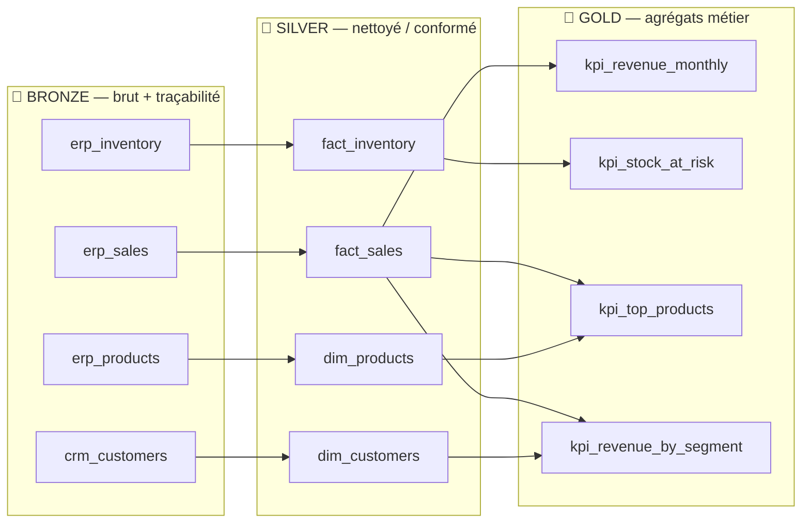
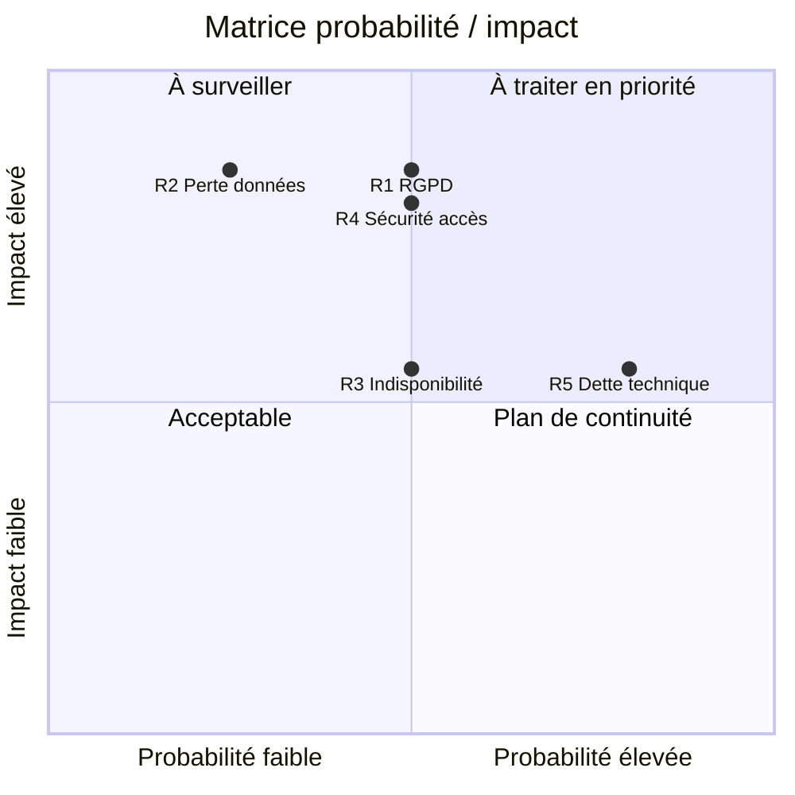

# Phase 2 — Spécification technique

**Livrable :** modèle de données (Bronze/Silver/Gold) + cahier des charges
fonctionnel + matrice des risques + conformité & accessibilité.

---

## 1. Modèle de données en 3 couches (medallion)

Le modèle couvre **deux domaines métier** : **Ventes** et **Stocks**, enrichis
par le référentiel **Client** (CRM).

### 1.1 Couche Bronze — exemples de tables

> Règle : **aucune transformation métier**. On conserve le brut (tout en texte)
> et on ajoute des métadonnées de traçabilité.

**`erp_sales`** (domaine Ventes)

| Colonne | Type | Exemple | Note |
|---------|------|---------|------|
| sale_id | VARCHAR | `S000142` | brut |
| product_id | VARCHAR | `P0007` | brut |
| customer_id | VARCHAR | `C0031` | brut |
| sale_date | VARCHAR | `05/01/2024` | **format hétérogène conservé** |
| quantity | VARCHAR | `-3` | valeur aberrante conservée |
| unit_price | VARCHAR | `` (vide) | manquant conservé |
| channel / country | VARCHAR | `web` / `fr` | casse brute |
| `_source_system` | VARCHAR | `ERP` | **métadonnée** |
| `_source_file` | VARCHAR | `g_fact_sales.csv` | **métadonnée** |
| `_ingested_at` | TIMESTAMP | `2026-06-30T10:21Z` | **métadonnée** |

**`erp_inventory`** (domaine Stocks) : `snapshot_date, product_id, warehouse, stock_qty, reorder_point` + métadonnées.

### 1.2 Couche Silver — exemples de tables

> Règle : **typage strict, conformation, qualité**.

**`fact_sales`** (Ventes, nettoyée)

| Colonne | Type | Transformation appliquée |
|---------|------|--------------------------|
| sale_id | VARCHAR | trim + **dédoublonnage** (1 ligne / sale_id) |
| sale_date | DATE | **parsing multi-format** (ISO + JJ/MM/AAAA) |
| quantity | INTEGER | cast ; **filtre `> 0`** (retours écartés du CA) |
| unit_price | DECIMAL(10,2) | cast ; **ré-imputé** depuis `dim_products` si manquant |
| line_amount | DECIMAL(10,2) | **calcul** `quantity × unit_price` |
| channel / country | VARCHAR | **normalisation** (UPPER, trim) |

**`fact_inventory`** (Stocks) : `snapshot_date DATE, product_id, warehouse, stock_qty INT, reorder_point INT` (typage + dédoublonnage).

### 1.3 Couche Gold — exemples de tables

> Règle : **agrégats prêts pour la consommation** (BI/IA), modélisés par KPI.

| Table Gold | Grain | Colonnes |
|------------|-------|----------|
| `kpi_revenue_monthly` | mois | `month, orders, revenue` |
| `kpi_stock_at_risk` | produit × entrepôt | `product_id, warehouse, stock_qty, reorder_point, shortfall` |
| `kpi_top_products` | produit | `product_id, product_name, category, units_sold, revenue` |
| `kpi_revenue_by_segment` | segment client | `segment, active_customers, revenue` |

### 1.4 Justification des transformations entre couches

| Passage | Justification |
|---------|---------------|
| Bronze → Silver | Fiabiliser : sans typage ni dédoublonnage, les KPI seraient faux (doublons gonflant le CA, dates illisibles). Le filtre qualité protège l'aval. |
| Silver → Gold | Performance & usage : pré-agréger évite de rescanner les faits à chaque requête BI ; le grain Gold correspond à la question métier. |
| Conservation du Bronze | Réversibilité & IA : on peut rejouer l'historique ou ré-entraîner un modèle sur la donnée brute si une règle Silver évolue. |

---

## 2. Cahier des charges fonctionnel (priorisation MoSCoW)

| # | Fonctionnalité | Description | Critère d'acceptation | Priorité |
|---|----------------|-------------|-----------------------|----------|
| F1 | **Ingestion multi-sources** | Charger les fichiers des 3 silos dans la couche Bronze avec traçabilité (source, horodatage). | Les 6 tables Bronze sont produites ; chaque ligne porte `_source_system` et `_ingested_at`. | **Must** |
| F2 | **Nettoyage & conformation (Silver)** | Typage, parsing des dates, dédoublonnage, filtres qualité, ré-imputation. | `fact_sales` ne contient ni doublon de `sale_id`, ni quantité ≤ 0, ni date nulle. | **Must** |
| F3 | **Agrégation métier (Gold)** | Calculer les KPI (CA mensuel, par pays/canal/segment, top produits, risque stock). | Les 6 tables Gold sont générées et cohérentes avec Silver. | **Must** |
| F4 | **API BI de requêtage** | Exposer les KPI Gold en JSON via des endpoints REST documentés. | `GET /api/kpi/revenue/monthly` renvoie 200 + JSON valide ; doc Swagger disponible. | **Must** |
| F5 | **Dashboard accessible** | Restituer les KPI dans une UI web conforme RGAA/WCAG. | Le dashboard affiche synthèse + 3 tableaux ; navigation clavier OK ; contraste AA. | **Should** |
| F6 | **Gestion des droits par couche** | Restreindre l'accès : Bronze (data eng), Silver (analystes), Gold (tous via API). | Matrice de droits documentée ; principe du moindre privilège appliqué. | **Should** |
| F7 | **Pipeline orchestré & reproductible** | Rejouer tout le flux par une commande unique, déterministe. | `python src/pipeline.py` reconstruit l'intégralité du Lakehouse sans intervention. | **Should** |
| F8 | **Capture de changements (CDC)** | Ingestion incrémentale des nouvelles ventes (delta) plutôt que rechargement complet. | Conception documentée (clé + horodatage) ; implémentation hors périmètre POC. | **Could** |

---

## 3. Matrice des 5 risques clés

| # | Risque | Probabilité | Impact | Mitigation concrète |
|---|--------|-------------|--------|---------------------|
| R1 | **Non-conformité RGPD** (données client non traçables) | Moyenne | Élevé | Traçabilité d'ingestion (Bronze), minimisation des données personnelles, droits par couche, durée de rétention définie, pseudonymisation des PII en Gold. |
| R2 | **Perte de données** | Faible | Élevé | Conservation du Bronze immuable (source rejouable), stockage objet versionné, sauvegardes, pipeline déterministe reproductible depuis le README. |
| R3 | **Indisponibilité du service BI** | Moyenne | Moyen | Découplage stockage/compute, API stateless scalable horizontalement, endpoint `/health`, dégradation gracieuse (l'UI affiche un message si l'API est down). |
| R4 | **Sécurité des accès** | Moyenne | Élevé | Principe du moindre privilège (matrice de droits), authentification sur l'API (à activer hors POC : OAuth2/JWT), chiffrement en transit (HTTPS) et au repos. |
| R5 | **Dette technique** | Élevée | Moyen | Formats ouverts (Parquet, pas de verrou), séparation claire des couches, code versionné Git, conformité accessibilité dès la conception (évite la dette de mise en conformité). |

---

## 4. Conformité & Accessibilité Numérique

### 4.1 Normes de référence
- **RGAA** — Référentiel Général d'Amélioration de l'Accessibilité (cadre légal français, transposition de WCAG pour le service public et au-delà).
- **WCAG 2.1** — Web Content Accessibility Guidelines (niveau **AA** visé), socle international fondé sur 4 principes : *perceptible, utilisable, compréhensible, robuste*.

### 4.2 Trois mesures concrètes pour le futur dashboard

1. **Gestion des contrastes (malvoyants)** — palette garantissant un ratio de
   contraste **≥ 4,5:1** (WCAG AA) pour tout texte et tout KPI ; les indicateurs
   ne reposent jamais sur la seule couleur (libellé + valeur chiffrée).
2. **Compatibilité lecteurs d'écran (KPI)** — HTML **sémantique** (`<table>` avec
   `<caption>` et `<th scope>`, `<h1>`, `<label>`), zones dynamiques annoncées via
   `aria-live` pour que la mise à jour des KPI soit vocalisée.
3. **Navigation clavier intégrale** — tous les contrôles atteignables et
   actionnables au clavier, **focus visible**, et **lien d'évitement** (« aller au
   contenu ») pour les utilisateurs de lecteurs d'écran et de clavier seul.

> Ces 3 mesures sont **déjà implémentées** dans le POC (`poc/web/index.html`) et
> donc démontrables en soutenance.

### 4.3 Intérêt stratégique (argument conseil)
L'accessibilité **augmente l'adoption** de l'outil par l'ensemble des
collaborateurs (y compris en situation de handicap) et **réduit la dette
technique de conformité** : intégrée dès la conception, elle évite une coûteuse
mise en conformité ultérieure. C'est un investissement, pas une contrainte.
