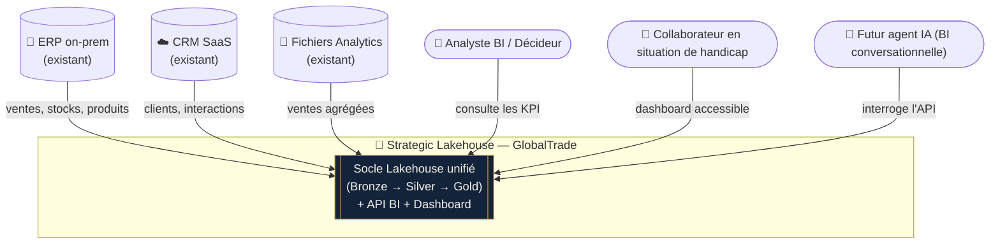
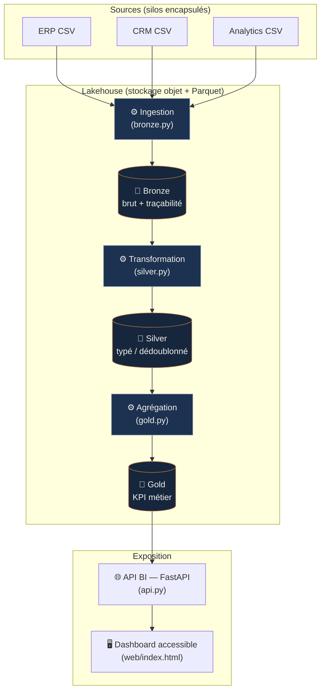

# Phase 3 — Conception et POC

**Livrable :** 3 schémas C4/UML + POC de bout en bout démontrable.

Le code du POC se trouve dans [`../poc/`](../poc/) — voir
[`poc/README.md`](../poc/README.md) pour le lancement reproductible.

---

## 1. Schéma C4 niveau 1 — Contexte système

*Qui interagit avec le Strategic Lakehouse et avec quels systèmes existants.*



**Lecture :** le Lakehouse devient le **point d'intégration unique**. Les 3
systèmes existants ne sont pas remplacés mais **encapsulés** comme sources
(urbanisation). Les consommateurs (humains et, demain, agents IA) passent tous
par la même API.

---

## 2. Schéma C4 niveau 2/3 — Composants de l'architecture interne

*Décomposition interne du socle Lakehouse.*



| Composant | Responsabilité | Techno |
|-----------|----------------|--------|
| Ingestion | Charger le brut + métadonnées | DuckDB `read_csv_auto` → Parquet |
| Bronze | Stocker le brut immuable | Parquet (stockage objet) |
| Transformation | Typage, qualité, dédoublonnage | DuckDB SQL |
| Silver | Stocker la donnée conformée | Parquet |
| Agrégation | Calculer les KPI | DuckDB SQL |
| Gold | Stocker les agrégats métier | Parquet |
| API BI | Servir les KPI en JSON | FastAPI / Uvicorn |
| Dashboard | Restituer (accessible) | HTML/JS sémantique |

---

## 3. Schéma de flux d'ingestion — de la source brute à Gold

*Parcours d'un enregistrement de vente à travers les couches.*

```mermaid
sequenceDiagram
    autonumber
    participant SRC as Source ERP (CSV)
    participant BRZ as Bronze
    participant SLV as Silver
    participant GLD as Gold
    participant API as API BI

    SRC->>BRZ: ligne brute "05/01/2024 ; qty=-3 ; price=∅"
    Note over BRZ: + _source_system, _ingested_at<br/>aucune transformation
    BRZ->>SLV: typage + parsing
    Note over SLV: date→DATE, qty filtré (>0),<br/>price ré-imputé, dédoublonnage
    SLV->>GLD: agrégation
    Note over GLD: SUM(line_amount) GROUP BY mois
    GLD->>API: lecture Parquet (DuckDB)
    API-->>API: GET /api/kpi/revenue/monthly → JSON
```

**Exemple concret (traçable dans le POC) :** une ligne avec date `05/01/2024`,
quantité `-3` et prix vide entre en Bronze **telle quelle**. En Silver, la date
est parsée, la ligne au quantité négative est **écartée** (retour, pas une
vente), le prix manquant serait **ré-imputé**. En Gold, seules les ventes
valides alimentent le CA mensuel. L'API sert le résultat fiabilisé.

---

## 4. Le POC en pratique

Implémentation **minimale mais de bout en bout** (cf. [`poc/`](../poc/)) :

| Étape | Fichier | Démontre |
|-------|---------|----------|
| Bronze — ingestion CSV | `poc/src/bronze.py` | Chargement brut + traçabilité |
| Silver — nettoyage | `poc/src/silver.py` | Typage, dédoublonnage, qualité |
| Gold + API — KPI JSON | `poc/src/gold.py`, `poc/src/api.py` | KPI métier exposé en JSON (FastAPI) |
| Bonus — UI temps réel | `poc/web/index.html` | Dashboard **accessible** (RGAA/WCAG) |
| Versioning + README | ce dépôt Git | Démo **reproductible** |

**Démonstration live (soutenance) :**
```bash
cd poc && python src/pipeline.py        # construit le Lakehouse
uvicorn src.api:app --reload            # API + dashboard
# → http://127.0.0.1:8000/docs : appel live de GET /api/kpi/revenue/monthly
```

L'intégration des recommandations d'accessibilité est **démontrable même sur ce
prototype minimaliste** : balises sémantiques, contraste conforme PSH,
navigation clavier (cf. [`docs/02`](02-specification-technique.md) §4).
